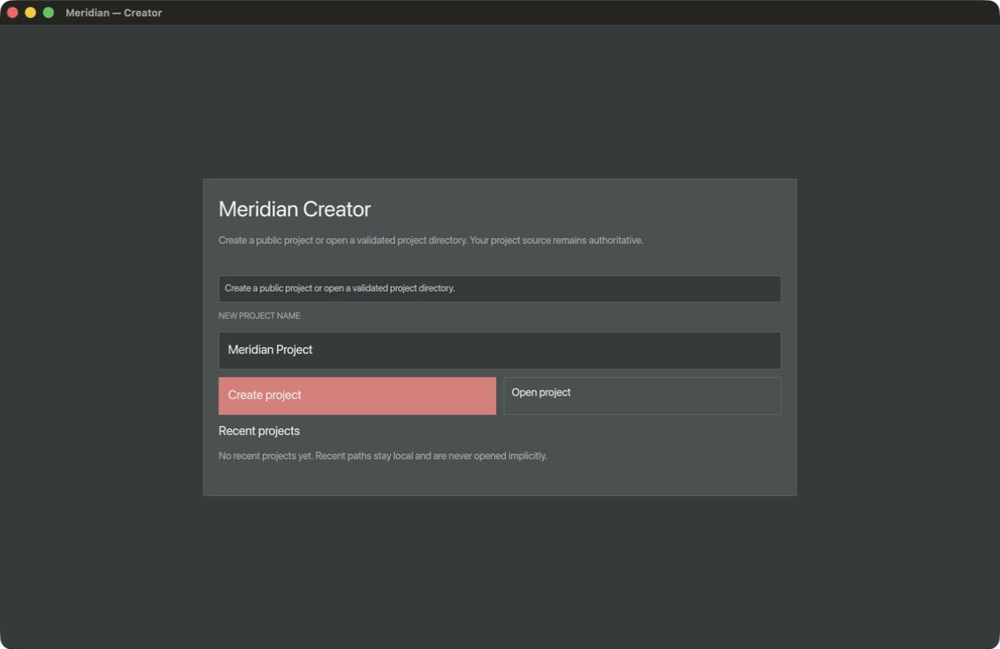
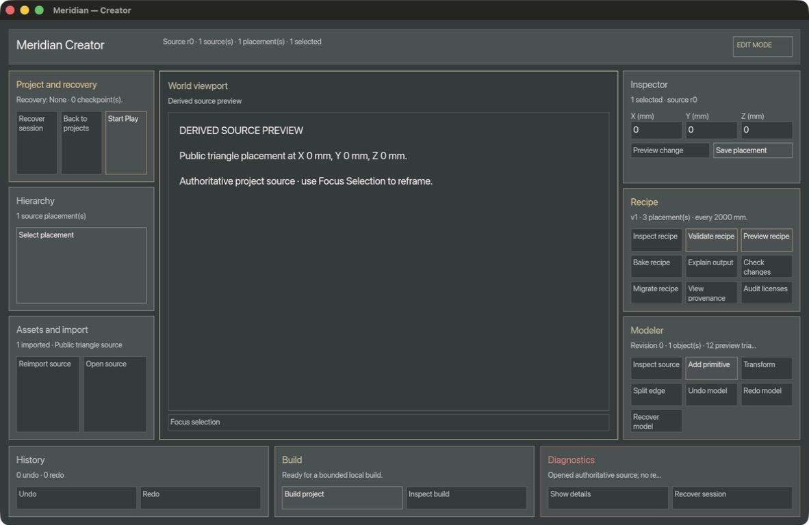

# MS-03 Creator Alpha native review

Status: local pre-delivery review recorded; fresh three-platform CI and the
post-CI source revision are still required before `WP-EDT-001` or MS-03 can be
closed.

This review covers the Creator application surface, not renderer visual
quality. The app was built locally from the pending MS-03 delivery on an Apple
M4 (`arm64`) running macOS 27.0 (26A5368g) on 2026-07-17. The local candidate
was intentionally not yet a committed or CI-qualified revision.

Fresh-launch capture from the universal application bundle before any user
input: `evidence/ms03-creator-alpha-hub-20260717.jpeg`

SHA-256: `ecac3c8fd1cfd8148938ca6a871ff4023ae7eb94e77bdf6d9c98b7b243e94137`

Workspace capture after an explicit `--project examples/creator-alpha` launch:
`evidence/ms03-creator-alpha-workspace-20260717.jpeg`

SHA-256: `cc66f16f21a051836ce32c0aaf6c09fa353923fb9f0ace7e0b231d87ccc0ebc0`

## Observed native behavior

- Pass — `target/Meridian.app` launched a persistent `Meridian — Creator`
  window rather than an auto-exiting smoke surface.
- Pass — after a fresh non-smoke app launch, the hub rendered its first frame
  without a focus or pointer event; opening the public Creator Alpha project
  rendered the persistent workspace and its source-derived preview.
- Pass — the hub presents Create/Open project actions without beta or
  distribution-status labeling. The separate distribution notes retain the
  truthful signing and notarization status.
- Covered by deterministic tests — explicit picker cancellation remains a hub
  diagnostic and never opens a project implicitly; the native visual review
  did not repeat a native picker interaction.
- Covered by deterministic tests — Creator controls retain named keyboard and
  semantic routing; this local visual review does not claim full native
  assistive-technology integration.
- Pass — the packaged binary reported both `arm64` and `x86_64`, used
  `works.deadsignal.meridian`, and its generated SHA-256 manifest verified
  locally.

## Accessibility and review limits

- Not claimed — the macOS accessibility tree exposed the native window and
  menu but did not expose individual immediate-mode Creator controls to the
  system accessibility bridge during this review. The MS-03 platform adapter is
  a scoped foundation, not a completed production screen-reader integration.
- Not run manually — text/IME composition, scaling, contrast, reduced-motion,
  and a full keyboard traversal of every workspace panel. Their applicable
  deterministic semantic and input-routing tests remain part of the package
  gate; this capture does not replace them.
- Not claimed — Developer ID signing, notarization, Gatekeeper qualification,
  or verified-developer trust. The preview requires the user’s explicit
  standard Gatekeeper authorization as described in
  [the unsigned preview notes](MACOS_UNSIGNED_PREVIEW.md).

The CI macOS artifact retains the distributable app archive, binary hash,
Creator journey evidence, this checklist, and these refreshed local captures
for the candidate run. They are evidence for review, not a substitute for the
required Linux, Windows, and macOS CI results.
